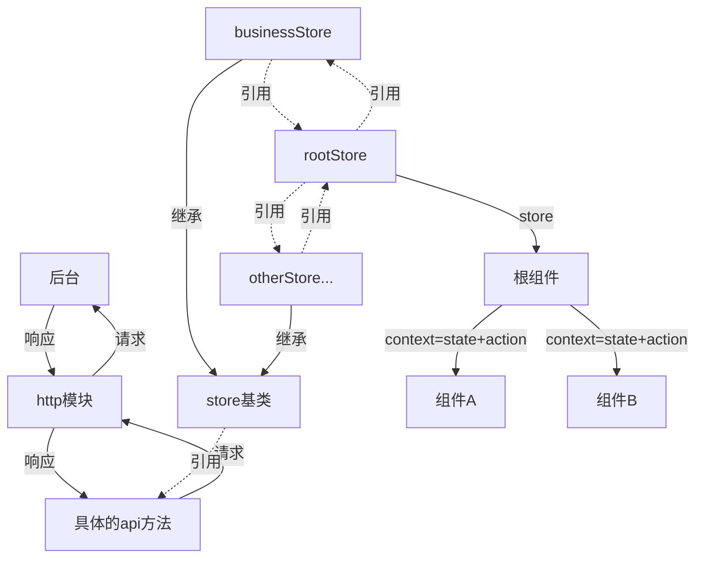

# taro-mobx-typescript-tpl
The best practice boilerplate with taro, ts and mobx 

## 目录结构

``` JavaScript
├── dist/                          // 默认的 build 输出目录
├── config/                        // taro的webpack配置
└── src/                           // 源码目录
    ├── components/                // 通用组件目录
    ├── dataPool/                  // 可选, 静态数据中心
        ├── data/                  // 静态数据来源(例如option数组,一些枚举类型和数据map)
        ├── interfaces/            // 自定义类型来源
    ├── http/                      // 配置url, 统一处理http请求, 只暴露具体方法供外界使用
        ├── api/                   // 具体请求方法
        ├── ...                    // 其他配置
    ├── lib/                       // 库文件
        ├── decorator/             // 装饰器方法
        ├── extent/                // 类的拓展
        ├── utils/                 // 工具函数
    ├── pages/                     // 页面目录, 必须和app.tsx里面路由一致
        ├── index/                 // 自定义页面
        ├── ...                    // ...
    ├── service/                   // 可选, 仅为store的辅助函数, 封装复杂业务逻辑; 避免过度使用
    ├── static/                    // 静态资源文件, 图片等
    ├── store/                     // 全局状态管理
        ├── index                  // 组合多个store
        ├── counter/               // 具体业务的store
        ├── step/                  // 具体业务的store
        ├── view/                  // 具体业务的store
        ├── ...                    // ...
    ├── style/                     // 自定义样式
    ├── app.scss                   // 约定的全局样式文件，自动引入，也可以用less
    ├── app.tsx                    // taro入口
    ├── index.html                 // h5 html模板
    ├── route.ts                   // 定义页面路由
├── typings                        // 全局类型定义

```

## 数据流向




